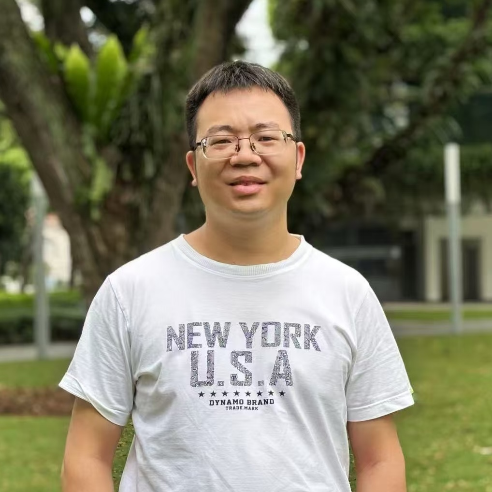

<!--- assets/img/panzhou4.jpg --->

You can also browse <a href="www.lv-nus.org" target="_blank" style="text-decoration:underline;">LV-SMU team</a>.   

 

#####  **Faculty**
<table style="width:25%">
  <tr>
    <td style="text-align:left;padding-right: 15px;"></td>
  </tr>
  <tr>
    <td style="text-align:center;padding-right: 15px;"><a href="https://panzhous.github.io/">ZHOU Pan</a>   Assistant Professor</td>
    <!-- <td style="text-align:center">    </td>
    <td style="text-align:center">    </td>
    <td style="text-align:center">    </td> -->
  </tr>
</table>

<!-- #####  **Visiting Faculty** 

<table style="width:75%">
  <tr>
    <td style="text-align:center"></td>
    <td style="text-align:center"></td>
  </tr>
  <tr>
    <td style="text-align:center"><a href="https://leon.bottou.org/">Leon Bottou</a>   Facebook AI</td>
    <td style="text-align:center"><a href="https://melaniemitchell.me/">Melanie Mitchell</a>   Portland State University</td>
  </tr>
</table> -->

 
 

#####  **Ph.D.** 

<table style="width:50%">
  <tr>
    <td style="text-align:center; padding-right: 15px;"></td>
      <!-- <td style="text-align:center"></td> -->
    <td style="text-align:center; padding-right: 15px;"></td>
      <!-- <td style="text-align:center"></td> -->
    <!-- <td style="text-align:center; padding-right: 15px;"></td> -->
  </tr>
  <tr>
    <td style="text-align:center; padding-right: 15px;"><a href="https://yqcca.github.io/">ZOU Xiandong</a>   Ph.D. (B.S. & M.S. at ICL)   2025/01 - present</td>
      <!-- <td style="text-align:center">    </td> -->
    <td style="text-align:center; padding-right: 15px;"><a href="">WU Jinyang</a>   Master (B.S.  at NTU)   2024/08 - present</td>
      <!-- <td style="text-align:center">    </td> -->
    <!-- <td style="text-align:center; padding-right: 15px;"><a href="">LI Jingyang</a>   Ph.D. at NUS, Co-supervised with Prof. Kim-chuan Toh   2021/08 - present</td> -->
  </tr>
</table>

 
 
#####  **Visiting Students** 

<table style="width:75%">
  <tr>
    <td style="text-align:center; padding-right: 15px;"></td> 
    <td style="text-align:center; padding-right: 15px;"></td> 
    <td style="text-align:center; padding-right: 15px;"></td> 
    <td style="text-align:center"></td>
  </tr>
  <tr>
    <td style="text-align:center; padding-right: 15px;"><a href="https://jliu4ai.github.io/">LIU Jie</a>  Ph.D. at University of Amsterdam   2024/01 - present</td> 
    <td style="text-align:center; padding-right: 15px;"><a href="https://scholar.google.com.sg/citations?user=jXLkbw8AAAAJ"> DONG Xiao</a>  Ph.D. at Sun Yat-sen University   2024/10 - present</td> 
    <td style="text-align:center; padding-right: 15px;"><a href="https://scholar.google.com/citations?user=GIBwOR8AAAAJ">ZHAO Qi</a>  Ph.D. at Nanjing University   2024/09 - present</td> 
    <td style="text-align:center"><a href="https://xiarho.github.io/">XIAO Ruihao</a>  Ph.D. at  East China University of Science and Technology   2025/01 - present</td>
  </tr>
</table>

